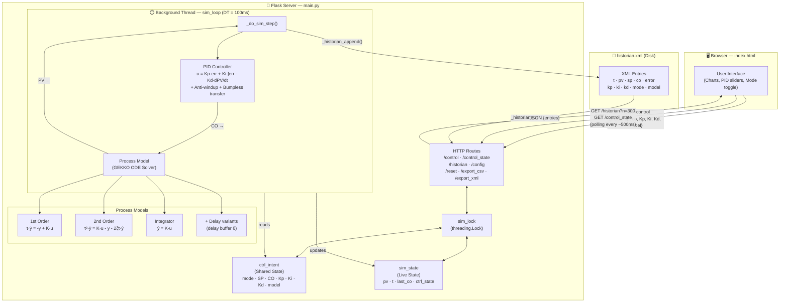

# PIDSim
General multi-purpose dynamically controlled process simulator.

In BASH (https://www.pythonanywhere.com/user/AGLajoie/consoles/46877070/)
(in case of mistake : rm -r directory_to_remove)

—— Step 1 ——————————————————————————————————————

git clone https://github.com/AGLajoie/PIDSim.git

—— Step 2 ——————————————————————————————————————

cd PIDSim

—— Step 3 ——————————————————————————————————————

mkvirtualenv --python=python3.10 pidsim-env

—— Step 4 ——————————————————————————————————————

pip install -r requirements.txt

—— Step 5 ——————————————————————————————————————

python main.py

—— Step 6 ——————————————————————————————————————

WSGI configuration file:
import sys
sys.path.insert(0, '/home/AGLajoie/PIDSim')

from main import application

BaSH :

cd ~

git clone https://github.com/AGLajoie/PIDSim.git

cd PIDSim

mkvirtualenv --python=python3.10 pidsim-env

pip install -r requirements.txt

python main.py

—— Step 7 ——————————————————————————————————————

git status

git pull origin

# Flowchart

